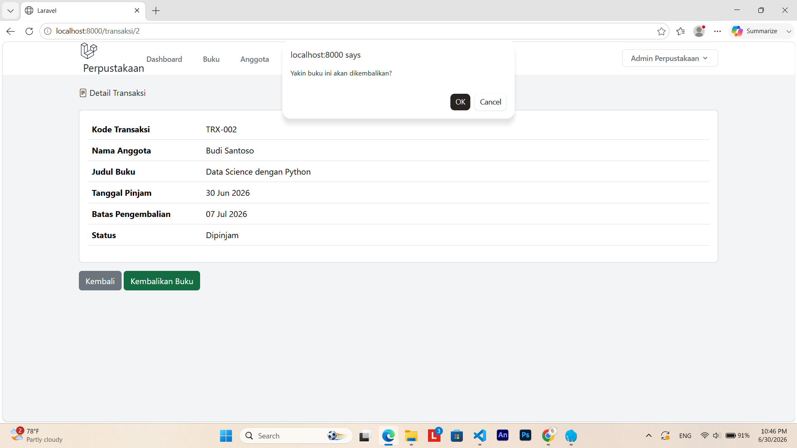
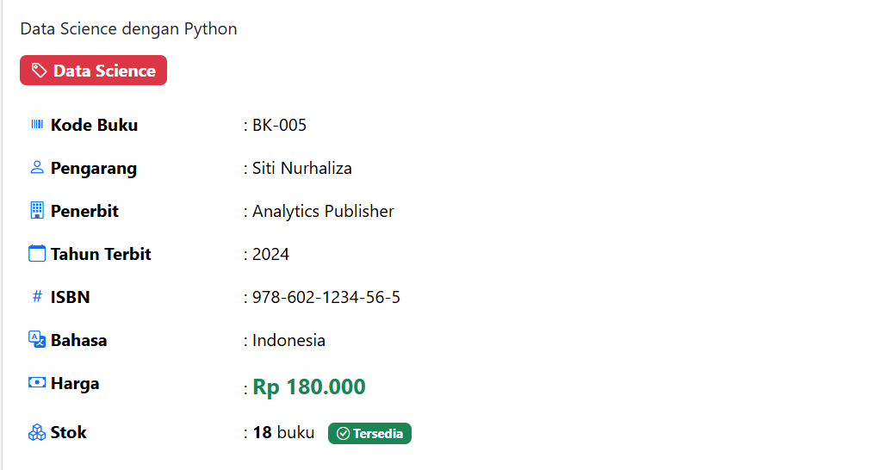

# PROJECT FINAL 

---

**Nama:** Najwa Armia Zahra  
**NIM:** 60324002  
**Prodi:** Informatika  
**Semester:** 4  
**Mata Kuliah:** Pemrograman Web II  

---
#### 1. Authentication System
* Login 
* Register
* Logout 
* Password Hashing 
* Middleware protection
---
#### 2. CRUD Buku Lengkap
* Create
* Read
* Update
* Delete
* Validation
* Search & Filter 
---
#### 3. CRUD Anggota Lengkap
* Create 
* Read 
* Update
* Delete 
* Date Handling 
* Email & Phone validation
---
#### 4. Transaksi Peminjaman
* Form peminjaman
* Auto update stok (-1)
* Generate kode transaksi
* Tanggal kembali auto (+7 hari)
---
#### 5. Pengembalian Buku 
* Update status
* Perhitungan denda (Rp 5.000/hari)
* Auto update stok (+1)
---
#### 6. Dashboard
* Minimum 6 statistics
* 2 charts (line + pie/bar)
* Recent data tables
* Quick actions
---
#### 7. Global Search
* Search 3 modules
* Results dalam tabs
* Keyword highlighting
---
#### 8. Laporan Transaksi
* Filter (date, status, anggota)
* Statistics summary
* Print-friendly
### Setelah di kembalikan 

