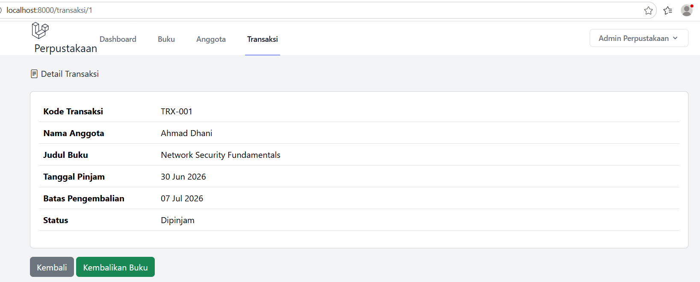
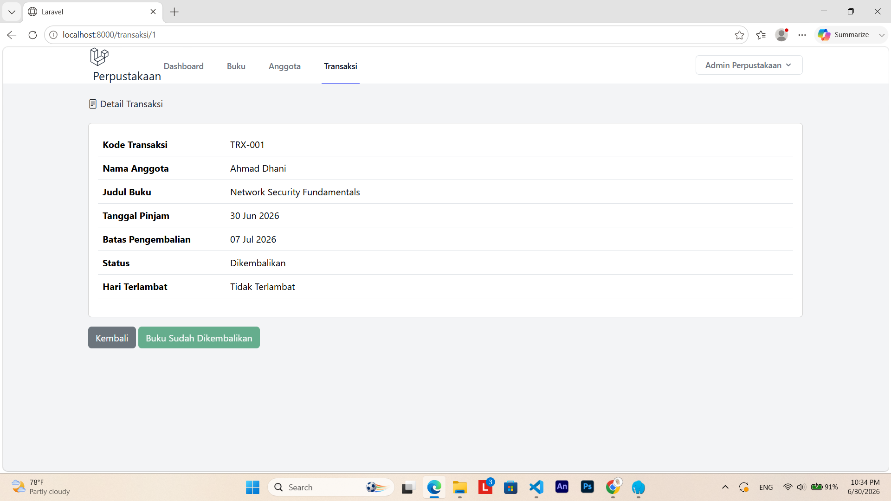
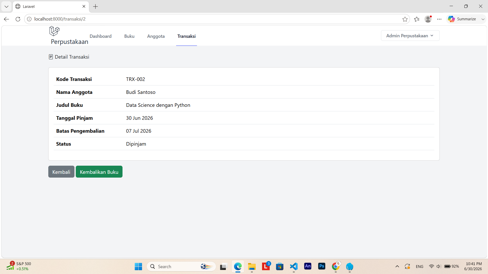
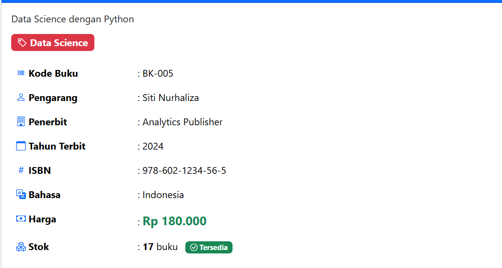

# Tugas Pertemuan 14 - AUTHENTICATION & TRANSAKSI PEMINJAMAN

---

**Nama:** Najwa Armia Zahra  
**NIM:** 60324002  
**Prodi:** Informatika  
**Semester:** 4  
**Mata Kuliah:** Pemrograman Web II  

---
## Tugas 1 - Fitur Pengembalian Buku 
### 1. View Detail Transaksi dengan button `("Kembalikan Buku")`

---
### 2. Method `kembalikan()` di Controller (sudah ada template)
### 3. Perhitugan Denda:
* Denda Rp 5.000/hari
* Hanya jika terlambat
* Tampilkan total denda di detail

---
### 4. Update Stok: Stok buku bertambah 1 saat dikembalikan

### Setelah di kembalikan 

